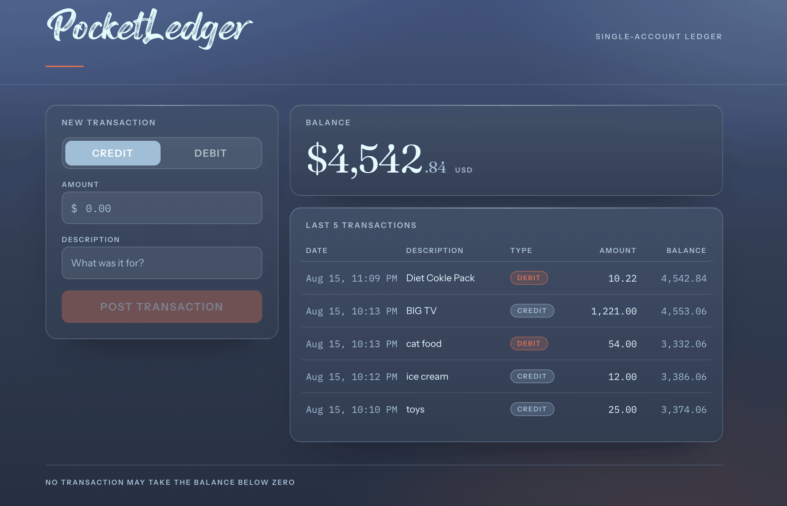
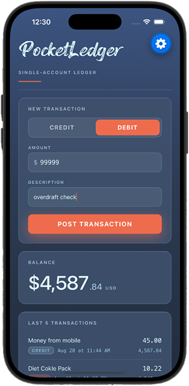

# PocketLedger

PocketLedger is a simple, single-account ledger built to make money tracking dependable and easy. It includes an Express + TypeScript API, a React + TypeScript web app, an Expo React Native mobile app, and JSON-based transaction storage.

One rule: **the balance can never fall below zero.** If a debit would overdraw the account, PocketLedger declines it.
<br>
### App Screenshot:


## Easy developer setup

To run the API and web app side by side on your local `cd` into the root project:

```bash
# Change directories into the project
cd ~/{projects}/PocketLedger

# Install all dependendencies
npm install

# Run web and server concurrently
npm run dev
```

The API runs at <http://localhost:4400> and the web app at <http://localhost:5273>.


To run the test suite:

```bash
npm test
```

To type-check every side of the project — server, web and mobile:

```bash
npm run typecheck
```


Each folder contains small, focused modules exported through an index.ts barrel file. This lets imports target the folder instead of individual files, a pattern inspired by **Angular** and **React library development.**


## Mobile

The mobile app is Expo + React Native, in `mobile/`. It runs the same logic the
web app does — see [Shared code](#shared-code).



```bash
# Once, to install the app's dependencies
npm run install:mobile

# The app needs the API, so start that first (in its own terminal)
npm run dev:api

# Then the bundler, and open it on a simulator
npm run ios      # or: npm run android
```

The app finds the API by itself: it takes the host Expo served the bundle from
and talks to port 4400 there, so a phone on the same network needs no address
configured by hand.

`mobile/` is deliberately **not** an npm workspace. React Native and
`react-native-web` both answer to the name `react-native`, and hoisting the
native package into the root `node_modules` puts it in reach of the web build's
resolver. Keeping the app's dependencies to itself means the web bundle cannot
change because of something mobile installed. `mobile/metro.config.js` bridges
the gap: it watches `shared/` and pins resolution to `mobile/node_modules`, so
React stays a single copy.


## Shared code

`shared/` holds everything the three sides have in common. The root export is
the wire contract, which is all the server sees; the rest is client logic that
the web and mobile apps both run:

| Import | What it is |
| --- | --- |
| `@pocketledger/shared` | The wire contract — transactions, accounts, errors, envelopes |
| `@pocketledger/shared/api` | The fetch client, the React Query hooks and cache keys |
| `@pocketledger/shared/store` | The zustand store holding the draft transaction |
| `@pocketledger/shared/submission` | The submit state machine — idle, submitting, accepted, refused, failed |
| `@pocketledger/shared/form` | `useSubmit`: what the amount parses to, whether the button is live |
| `@pocketledger/shared/format` | Money, figures, dates |
| `@pocketledger/shared/theme` | The five colours the whole product is drawn from |
| `@pocketledger/shared/animation` | The entrance order and its ladder of delays |

What is *not* shared is presentation. The web app is gluestack-ui over
`react-native-web`, leaning on real CSS for its frosted panels and hover states;
the mobile app is plain React Native primitives. Both read their colours from
`shared/src/theme/palette.ts`, so the product repaints from one file.

The masthead face in `shared/assets/fonts/` is likewise used by both.


## API

| Method | Path | Purpose |
| --- | --- | --- |
| `GET` | `/api/account` | Balance and transaction count |
| `GET` | `/api/transactions` | The last 5 transactions, newest first |
| `POST` | `/api/transactions` | Write one transaction |

Every response uses the same pattern:

```jsonc
{ "ok": true,  "data": { } }
{ "ok": false, "error": { "code": "INSUFFICIENT_FUNDS", "message": "Not enough funds. Balance is $3789.31." } }
```

#### Only two status codes are used. 

| CODE | Meaning |
| --- | --- |
| `200` | `Reequest is sucessful` |
| `500` | `Serverside error` |

<br>
The server sets the timestamp, so a request carries only `amount`, `type`, and `description`.


#### State Management

Posting follows a **state machine** in `server/src/posting/machine.ts`:

`idle → validating → checkingFunds → persisting → settled`

Because `persisting` is only reached after the funds check passes, overdrafts cannot be written to disk. The form uses a separate state machine to prevent duplicate submissions.

State machines are managed with [typed-fsm](https://github.com/rosano-alex/typed-fsm).

**Zustand** manages application state on both the client and server:

- **Server:** In-memory account state
- **Client:** Form drafts and submission state

**TanStack Query** manages server data, including the balance and transaction history, and provides a single source of truth for fetched data.

### Additional Highlights
**Writes are safe.** `I/O` is asynchronous. Each update is written to a temp file, then renamed over the ledger, so a crash cannot ruin the data. Postings are serialized to prevent concurrent debits from reading the same balance and jointly overdrawing the account. If a write fails, the in-memory balance is rolled back.

**An unreadable ledger stops the server.** A missing file is treated as a new account; any other read error prevents startup, protecting existing transaction data from being overwritten.

Transactions live in `server/data/transactions.json`. The file is created on the first write and ignored by Git. Set `LEDGER_FILE` to use a different location.
<br><br>
### Front end data flow:


<br><br>
### Back end data flow:


