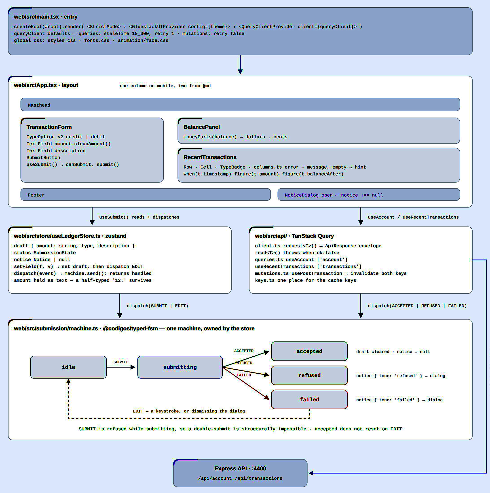
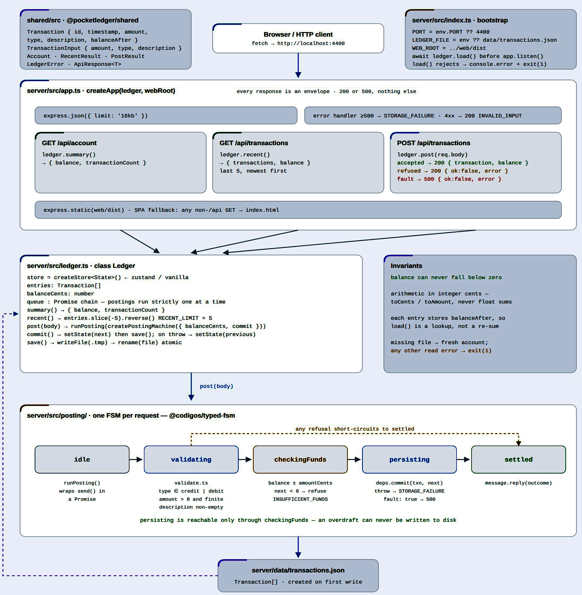

# PocketLedger

PocketLedger is a simple, single-account ledger built to make money tracking dependable and easy. It includes an Express + TypeScript API, a React + TypeScript web app, and JSON-based transaction storage.

One rule: **the balance can never fall below zero.** If a debit would overdraw the account, PocketLedger declines it.

## Easy developer setup

To run the API and web app side by side on your local:

```bash
npm install
npm run dev
```

The API runs at <http://localhost:4400> and the web app at <http://localhost:5273>.


To run the test suite:

```bash
npm test
```


Each folder contains small, focused modules exported through an index.ts barrel file. This lets imports target the folder instead of individual files, a pattern inspired by **Angular** and **React library development.**


## API

| Method | Path | Purpose |
| --- | --- | --- |
| `GET` | `/api/account` | Balance and transaction count |
| `GET` | `/api/transactions` | The last 5 transactions, newest first |
| `POST` | `/api/transactions` | Write one transaction |

Every response uses the same pattern:

```jsonc
{ "ok": true,  "data": { } }
{ "ok": false, "error": { "code": "INSUFFICIENT_FUNDS", "message": "Not enough funds. Balance is $3789.31." } }
```

#### Only two status codes are used. 

| CODE | Meaning |
| --- | --- |
| `200` | `Reequest is sucessful` |
| `500` | `Serverside error` |

<br>
The server sets the timestamp, so a request carries only `amount`, `type`, and `description`.


#### State Management

Posting follows a **state machine** in `server/src/posting/machine.ts`:

`idle → validating → checkingFunds → persisting → settled`

Because `persisting` is only reached after the funds check passes, overdrafts cannot be written to disk. The form uses a separate state machine to prevent duplicate submissions.

State machines are managed with [typed-fsm](https://github.com/rosano-alex/typed-fsm).

**Zustand** manages application state on both the client and server:

- **Server:** In-memory account state
- **Client:** Form drafts and submission state

**TanStack Query** manages server data, including the balance and transaction history, and provides a single source of truth for fetched data.

### Additional Highlights
**Writes are safe.** `I/O` is asynchronous. Each update is written to a temp file, then renamed over the ledger, so a crash cannot ruin the data. Postings are serialized to prevent concurrent debits from reading the same balance and jointly overdrawing the account. If a write fails, the in-memory balance is rolled back.

**An unreadable ledger stops the server.** A missing file is treated as a new account; any other read error prevents startup, protecting existing transaction data from being overwritten.

Transactions live in `server/data/transactions.json`. The file is created on the first write and ignored by Git. Set `LEDGER_FILE` to use a different location.
<br><br><br>
### Front end data flow:


<br><br>
### Back end data flow:



